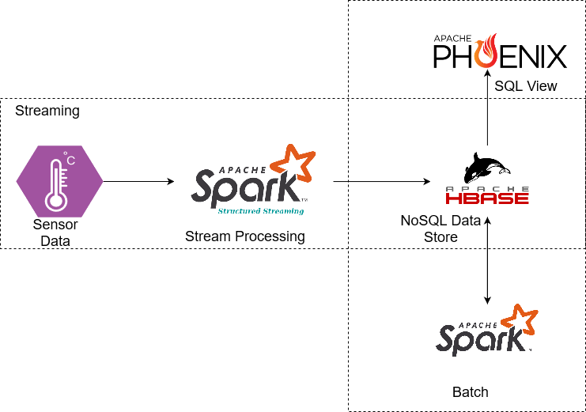

## Oil Well Use Case with HBase, Phoenix and Spark

### Business objective

Sensor networks clearly focus on a wide range of practice-oriented research as
individual sensors and related networks for structural monitoring and highly efficient
monitoring. The sensor network is designed to respond to emergencies in real-time
while observing the radiation field. An intelligent system-based sensor network is
presented and used to monitor the condition of remote wells. The network consists of
three sensors used to collect oil field data, including temperature, pressure, and gas.
Intelligent microprocessor sensors are generally designed for oil well data processing,
critical failure alarms or signals, traditional data storage or signals, and data/status
connections.

#### Aim

To build an application that monitors oil wells. Sensors in oil rigs generate streaming
data processed by Spark and stored in HBase for use by various analytical and
reporting tools.

#### Streaming data

Streaming data is continuously generated by thousands of data sources and typically
sends datasets in small sizes (in the order of kilobytes) at the same time. Streaming
data includes customer-generated log files using mobile or web applications,
e-commerce purchases, in-game player activity, social networks, information from
financial exchanges or geospatial services.

#### Apache Phoenix

Apache Phoenix is a massively parallel relational open-source database engine that
uses Apache HBase as backing storage to support OLTP for Hadoop. Phoenix provides
a JDBC driver that hides the complexity of noSQL memory and allows users to create,
delete, and modify SQL tables, views, indexes, and sequences. It allows inserting and
deleting rows at once, one at a time, and querying the data via SQL. Phoenix compiles
queries and other statements into the native NoSQL storage API instead of
MapReduce. This allows you to build low latency applications on NoSQL storage.

#### HBase

HBase is a non-relational distributed open-source database written in Java. It was
developed as part of the Apache Software Foundation's Apache Hadoop project and ran
on HDFS (Hadoop Distributed File System), providing Hadoop with Bigtable-like
functionality. HBase provides column-by-column compression, in-memory operations,
and Bloom filters, as described in the original Bigtable paper. HBase tables serve as
input and output for MapReduce jobs running in Hadoop and can be accessed via the
Java API, but can also be accessed via REST, Avro, or the Thrift Gateway API.

### Tech Stack

● AWS EC2

● Docker

● python

● HBase

● Apache Spark SQL

● Spark Structured Streaming

● HDFS

● Apache Phoenix

● SBT

### Approach

● Create an AWS EC2 instance and launch it.

● Create docker images using docker-compose file on EC2 machine via ssh.

● Download the dataset and load it into HDFS storage.

● Read data from HDFS storage and write into HBase table using Spark.

● Create Phoenix view on top of HBase table to analyze data using SQL queries.

### Project Takeaways

● Understanding various services provided by AWS

● Creating an AWS EC2 instance and launching it

● Connecting to an AWS EC2 instance via SSH

● Copying a file from a local machine to an EC2 machine

● Dockerization

● Download the dataset and load it into HDFS

● Difference between RDBMS and HBase

● SBT packaging

● Read data from HDFS and write into HBase tables

● Understanding of Apache Phoenix

● Create a Phoenix view on top of the HBase table

### Project Architecture

